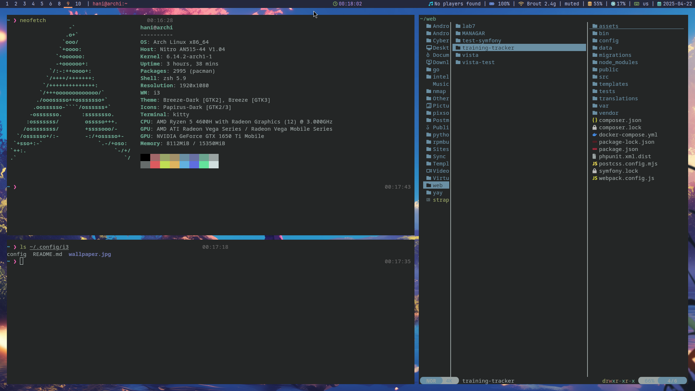

# Polybar Config for Arch Linux with i3wm by Hanashiko



Це моя кастомна конфігурація для [Polybar](https://github.com/polybar/polybar), створена для i3wm на Arch Linux. Вона оформлена у кольоровій гамі, яка сумісна з темами на кшталт Tokyonight та Nord.

## 📦 Зміст

- [🔧 Встановлення](#-встановлення)
- [🎨 Кольори](#-кольори)
- [📐 Основні параметри панелі](#-основні-параметри-панелі)
- [📊 Модулі](#-модулі)
- [🖼️ Приклад](#-приклад)
- [📃 Ліцензія](#-ліцензія)

---

## 🔧 Встановлення

1. Переконайтесь, що `polybar` встановлено:
   ```bash
   sudo pacman -S polybar
   ```

2. Склонуйте репозиторій:
   ```bash
   git clone https://github.com/Hanashiko/dotfiles-polybar ~/.config/polybar
   ```

3. Запусти бар:
   ```bash
   ~/.config/polybar/launch.sh
   ```

---

## 🎨 Кольори

Конфігурація підтримує широку палітру кольорів у `[colors]`. Основні з них:

| Назва         | Колір    |
|---------------|----------|
| background    | `#24283b` |
| foreground    | `#c0caf5` |
| alert         | `#e06c75` |
| orange        | `#ff9e64` |
| green         | `#9ece6a` |
| purple        | `#bb9af7` |
| cyan          | `#2ac3de` |
| pink          | `#f7768e` |

Використовуються переважно для тексту, значків, префіксів тощо.

---

## 📐 Основні параметри панелі

Панель `bar1` має такі налаштування:

- Висота: `22`
- Позиція: зверху
- Вирівнювання: фіксоване по центру
- Шрифти:
  - JetBrainsMono Nerd Font (основний)
  - FontAwesome (іконки)

Модулі:
- **Зліва:** `i3`, `xwindow`
- **По центру:** `date`
- **Справа:** `music`, `battery`, `network`, `pulseaudio`, `memory`, `cpu`, `xkeyboard`, `date2`

---

## 📊 Модулі

### 🧩 `i3`
Відображає робочі простори з акцентами на активний/невидимий/терміновий. Має кольорові акценти та підкреслення для активного.

### 🪟 `xwindow`
Показує заголовок активного вікна (до 60 символів).

### 🔊 `pulseaudio`
Аудіо гучність з іконкою та підтримкою м’юту.

### ⌨️ `xkeyboard`
Відображення активного розкладки (наприклад, `EN`, `UA`) з іконкою клавіатури.

### 🧠 `memory`
Використання оперативної пам’яті. Оновлюється кожні 2 секунди.

### 🧮 `cpu`
Завантаження CPU. Оновлення: кожні 2 секунди.

### 🕒 `date`
Час в форматі `%H:%M:%S`. Зелений префікс годинника.

### 📅 `date2`
Дата в форматі `%Y-%m-%d` з бірюзовим префіксом.

### 🎵 `music`
Підключено до `playerctl`. Виводить `artist - title`.

### 🔋 `battery`
Інформація про батарею: заряд, розряд, повна, низький рівень.

### 🌐 `network`
Wi-Fi статус та SSID, якщо підключено.

---

## 🖼️ Приклад

Ось як виглядає панель:


---
